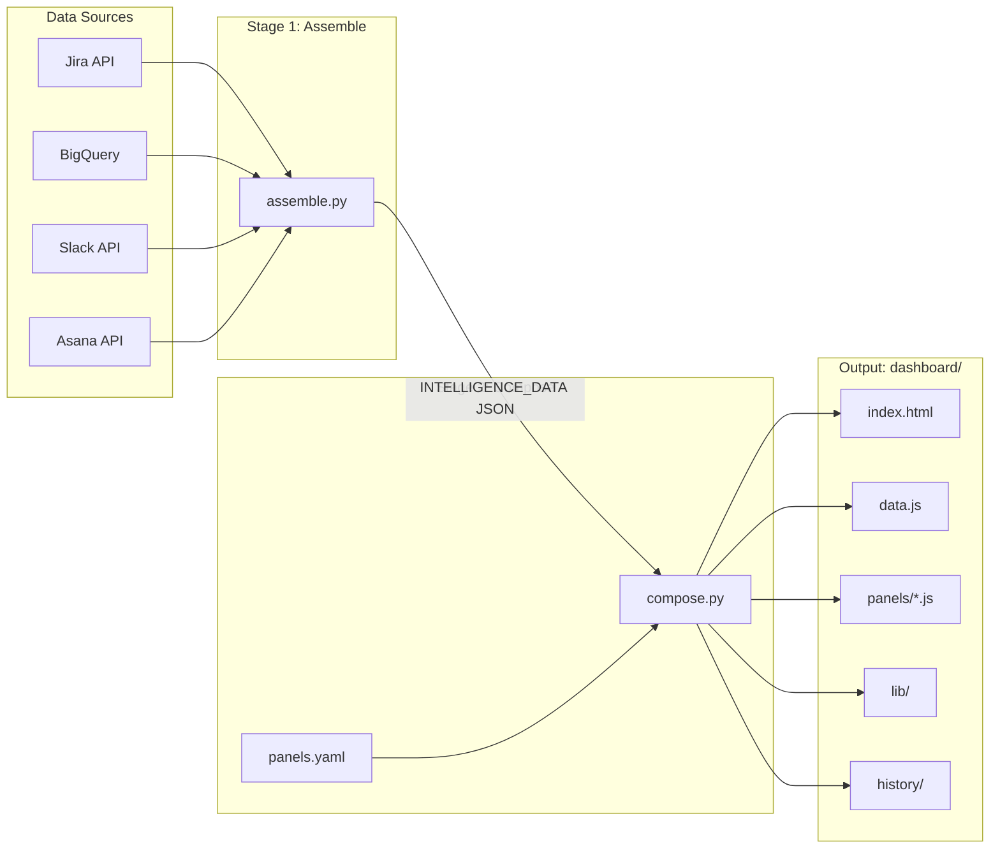
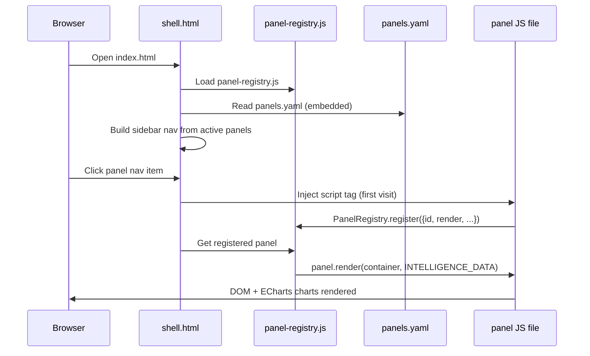

# W&B Field Engineering Skills

Claude Code skills for W&B Solutions Engineers. Hooks into W&B Jira, CoreWeave Slack, Confluence, Asana, Salesforce, BigQuery, and more — so you spend less time copy-pasting between tabs.

> **Heads up:** These skills talk to live systems. Reads are safe to run freely. Writes always ask before doing anything.

35 skills across customer engagement, action tracking, data sources, reporting, and setup.

## Quick Start

1. **Clone and install uv:**
   ```bash
   git clone https://github.com/wandb/field-eng-skills.git
   curl -LsSf https://astral.sh/uv/install.sh | sh
   ```

2. **Configure credentials** in `~/.fe-skills/.env`:
   ```bash
   # W&B Jira (coreweave.atlassian.net)
   # Get token: https://id.atlassian.com/manage-profile/security/api-tokens
   # Log in as your @wandb.com account on the coreweave instance
   ATLASSIAN_EMAIL=your.email@wandb.com
   ATLASSIAN_TOKEN=your-api-token

   # CoreWeave Confluence (coreweave.atlassian.net)
   # Same token page, but log in as your @coreweave.com account
   CONFLUENCE_EMAIL=your.email@coreweave.com
   CONFLUENCE_TOKEN=your-api-token

   # CoreWeave Slack
   # Extracted from browser session -- /slack-setup walks you through it
   SLACK_TOKEN=xoxc-...
   SLACK_COOKIE=xoxd-...

   # Asana (SE action tracking)
   # Generate at: https://app.asana.com/0/my-apps -> Personal Access Tokens
   ASANA_TOKEN=your-personal-access-token

   # W&B Salesforce (session auth via sf CLI OAuth)
   # Run: sf org login web -r https://wandb.my.salesforce.com
   # Then: sf org display --target-org wandb (copy Access Token + Instance Url)
   SFDC_SESSION_ID=your-access-token
   SFDC_INSTANCE=wandb.my.salesforce.com

   # Google Calendar (Apps Script)
   # Deploy the Apps Script project per /gcalendar-setup, copy the deployment URL and key
   GCALENDAR_APPSCRIPT_URL=https://script.google.com/macros/s/.../exec
   GCALENDAR_APPSCRIPT_KEY=your-secret-key

   # Google Docs (Apps Script)
   GDOCS_APPSCRIPT_URL=https://script.google.com/macros/s/.../exec
   GDOCS_APPSCRIPT_KEY=your-secret-key

   # Gmail (Apps Script, read-only)
   GMAIL_APPSCRIPT_URL=https://script.google.com/macros/s/.../exec
   GMAIL_APPSCRIPT_KEY=your-secret-key

   # Gong
   # Session cookie from browser dev tools -- /gong-setup walks you through it
   GONG_COOKIE=g-session=...; cell=...; AWSALB=...
   GONG_BASE_URL=https://us-XXXXX.app.gong.io
   GONG_WORKSPACE_ID=your-workspace-id
   ```

3. **Verify credentials:**
   ```
   /credential-status
   ```
   Run the setup skill for any service that fails: `/atlassian-setup`, `/slack-setup`, `/asana-setup`, `/salesforce-setup`, `/gcalendar-setup`, `/gdocs-setup`, `/gmail-setup`, `/gong-setup`, `/bigquery-setup`.

4. **BigQuery (ADC -- no token in .env):**
   ```bash
   gcloud auth application-default login
   gcloud auth application-default set-quota-project wandb-sa-sandbox
   ```

5. **First skill run:**
   ```
   /jira list --customer GResearch
   ```
   If this returns issues, your Jira credentials are working and you are ready to go.

6. **Install globally** (available in any project):
   ```bash
   ln -s $(pwd)/.claude/skills/* ~/.claude/skills/
   ln -s $(pwd)/.claude/rules/* ~/.claude/rules/
   ```

## Skills

### Customer Engagement

| Skill | Invocation | What it does |
|-------|-----------|--------------|
| **cadence-prep** | `/cadence-prep GResearch` | Prepares a customer cadence call agenda. Gathers Jira issues, Slack threads, Asana actions, product updates, and carry-forward items. Publishes to Confluence and optionally generates styled HTML. |
| **customer-snapshot** | `/customer-snapshot GResearch` | Builds a dashboard from Jira + Slack + Asana + BigQuery data. Up to 15 panels covering issues, usage, sentiment, analytics, and executive summary. |
| **jira-check** | `/jira-check GResearch` | Reviews customer Jira issues for staleness, drafts FE-UPDATE comments, and identifies issues needing attention. Runs across all customers when invoked without a name. |
| **pre-read** | `/pre-read GResearch` | Generates a structured pre-read document for a customer meeting by synthesizing Slack threads, Jira issues, and manual context. |
| **rats** | `/rats` | Searches your recent Slack posts and produces categorized output (Highlights, Lowlights, Learnings, Risks) for the team Roses & Thorns page. |

Example:
```
/customer-snapshot GResearch
```
Pulls Jira issues, BQ usage data, Asana tasks, and Slack sentiment in parallel, runs 9 analytics transforms, and drops the result in `customers/g-research/dashboard/index.html`.

### Asana Action Tracking

| Skill | Invocation | What it does |
|-------|-----------|--------------|
| **asana** | `/asana tasks --project-gid GID` | Query and manage SE action items in Asana. Supports projects, tasks, sections, search, and write operations (create, update, move, complete). |
| **raid** | `/raid GResearch` | View, scan for, or add RAID items (Risks, Assumptions, Issues, Dependencies). Manages Asana-native RAID logs with portfolio visibility across accounts. |
| **ghosted** | `/ghosted` | Track customer silence on Slack threads. Monitors "Waiting on Customer" tasks for unresponsive threads. |
| **nag** | `/nag` | Scan your Asana tasks for overdue and stale items across all customers. |
| **maction** | `/maction GResearch <notes>` | Extract action items and RAID signals from meeting notes or transcripts. Creates tracked Asana tasks from Granola summaries or pasted text. |

Example:
```
/nag
```
Scans all customer projects for overdue tasks and items that have not been updated in 7+ days. Outputs a prioritized list of things that need attention.

### Data Sources

| Skill | Invocation | What it does |
|-------|-----------|--------------|
| **jira** | `/jira list --customer GResearch` | Query, create, edit, and transition issues in W&B Jira (coreweave.atlassian.net). Supports FE-UPDATE comments, customer filtering, and JQL search. |
| **slack** | `/slack search "keyword"` | Search messages, read channel history, fetch threads, and look up users in the CoreWeave Slack workspace. |
| **confluence** | `/confluence search --title "Meeting Notes"` | Read, create, and update pages in CoreWeave Confluence (coreweave.atlassian.net). Supports CQL search, folders, attachments, and labels. |
| **salesforce** | `/salesforce account-detail --account-id ID` | Read-only Salesforce queries for account data (ARR, contract dates, team members, field discovery). Supports SSO/session auth for W&B's org. |
| **bigquery** | (building-block) | BigQuery usage data queries -- seat utilization, product areas, Weave ingestion, tracked hours, account health. Consumed by customer-snapshot, usage-report, deep-analytics, and lattice. |
| **gcalendar** | `/gcalendar events today` | Google Calendar via Apps Script + Chrome CDP. List calendars, get events, check availability. Okta SSO handled automatically. |
| **gdocs** | `/gdocs get --id DOC_ID` | Google Docs via Apps Script + Chrome CDP. Read and write documents. Okta SSO handled automatically. |
| **gmail** | `/gmail search --query "is:unread"` | Gmail via Apps Script + Chrome CDP. Search messages, read threads, list labels. Read-only. Okta SSO handled automatically. |
| **gong** | `/gong calls list --limit 10` | Gong call recordings, transcripts, and AI summaries. Cookie-based auth with automatic CDP fallback and credential refresh. |

Example:
```
/jira list --customer "Isomorphic Labs" --with-comments
```
Returns all open Jira issues for Isomorphic Labs with comment metadata (last comment date, eng response cadence, FE-UPDATE count).

### Reporting & Analytics

| Skill | Invocation | What it does |
|-------|-----------|--------------|
| **customer-snapshot** | `/customer-snapshot GResearch` | The whole dashboard — up to 15 panels (6 operational + 9 analytics). Runs the assemble.py/compose.py pipeline. |
| **usage-report** | `/usage-report GResearch` | Standalone ECharts usage report from BigQuery. Default is external (customer-facing, QBR-ready). Add `--internal` for SE prep with real names and churn risk. |
| **deep-analytics** | `/deep-analytics --customer GResearch --page cohort` | Individual deep-analytics pages (cohort, risk, journey, decay, velocity, team, SDK, correlation, performance). |
| **lattice** | `/lattice` | Weekly Lattice update generator. Gathers Slack, Asana, Jira, Calendar, and Gong activity, maps to IC5 growth areas. |
| **3p-update** | `/3p-update GResearch` | 3P (Progress/Plans/Problems) update from Asana tasks, Jira activity, and Slack signals. |
| **rats** | `/rats` | Roses & Thorns biweekly update from Slack activity. |

Example:
```
/usage-report "Isomorphic Labs" --internal
```
Queries BigQuery for 12 months of usage data, generates `customers/isomorphic-labs/usage/2026-04-04-usage-report-internal.html` with seat trends, product area radar, Weave ingestion, power users with real names, and churn risk assessment.

### Setup & Diagnostics

| Skill | What it does |
|-------|--------------|
| **atlassian-setup** | Guided setup for Jira and Confluence API tokens |
| **slack-setup** | Guided setup for Slack credentials (token + cookie extraction) |
| **asana-setup** | Guided setup for Asana Personal Access Token (PAT) |
| **salesforce-setup** | Guided setup for Salesforce credentials (sf CLI OAuth for SSO/2FA) |
| **customer-setup** | Interactive customer registry onboarding from Salesforce data with SE overlays |
| **credential-status** | Health check for all configured credentials |
| **credential-reference** | Reference table of all API credential keys and where they are used |
| **gcalendar-setup** | Guided setup for Google Calendar Apps Script deployment |
| **gdocs-setup** | Guided setup for Google Docs Apps Script deployment |
| **gmail-setup** | Guided setup for Gmail Apps Script deployment |
| **gong-setup** | Guided setup for Gong session cookie credentials |
| **bigquery-setup** | One-time BigQuery ADC connectivity verification |

For the full flat inventory with dependency graph and credential matrix, see [SKILL-INVENTORY.md](SKILL-INVENTORY.md).

## Workflow Patterns

Skills are designed to compose. Common multi-skill workflows documented in [`.claude/rules/skill-composition.md`](.claude/rules/skill-composition.md):

- **Issue Triage** -- slack + jira: investigate a customer-reported issue from report through resolution tracking
- **Customer Lookup** -- salesforce + jira + slack + confluence: build a picture of a customer's issue landscape
- **Customer Snapshot** -- jira + asana + bigquery + slack + customer-snapshot: full intelligence dashboard
- **Dashboard Generation** -- jira + bigquery + asana + slack + assemble.py + compose.py: the deterministic pipeline behind `/customer-snapshot`
- **Communication Prep** -- slack + jira + confluence + bigquery + gcalendar + gmail + gong: prepare for a customer meeting
- **FE-UPDATE Workflow** -- jira + slack: pull stale issues, gather Slack context, post structured updates
- **Action Tracking** -- slack + jira + asana: capture actions from conversations into tracked tasks
- **Programme Update** -- 3p-update orchestrates asana + jira + slack into a 3P report
- **RAID Management** -- raid + asana + jira + slack: risk register maintenance across accounts
- **Usage Report** -- bigquery + usage-report: standalone ECharts usage visualization
- **Customer Onboarding** -- asana + salesforce + jira + slack: set up a new customer's full structure
- **Customer Silence Check** -- ghosted + asana: monitor responsiveness on tracked threads
- **Meeting Follow-Up** -- maction + asana + raid: turn meeting notes into tracked work
- **Task Hygiene** -- nag + asana + ghosted: keep backlog clean and current
- **Lattice Weekly Update** -- slack + asana + jira + gcalendar + gong + bigquery + lattice: weekly performance update mapped to IC5 growth areas

## Customer Onboarding

How to add a new customer, start to finish. Using "Acme Corp" as the example.

### Step 1: Look up the customer in Salesforce

```
/salesforce account-search --name "Acme Corp"
```

Grab the 18-character Salesforce Account ID (e.g., `0012E00002ABcdEFGH`). Skills use this to pull business data (ARR, contracts, account team) at runtime.

### Step 2: Run customer setup

```
/customer-setup "Acme Corp"
```

It will:
- Pull account data from Salesforce
- Ask you for Slack channel IDs (look them up with `/slack search "acme"`)
- Ask for deployment type (saas / dedicated-cloud / server)
- Write an entry to `templates/customers.yaml`

### Step 3: Verify customers.yaml entry

After setup, your entry looks like this:

```yaml
- name: Acme Corp
  jira_customer: Acme Corp
  sfdc_account_id: "0012E00002ABcdEFGH"
  slack_channels:
    - id: C0EXAMPLE01
      name: wandb-acmecorp
      type: external
    - id: C0EXAMPLE02
      name: acme-internal
      type: internal
  action_tracker: asana
  action_tracker_id: "PLACEHOLDER"    # filled in Step 4
  raid_tracker: asana
  raid_tracker_id: "PLACEHOLDER"      # filled in Step 4
  portfolio_id: "PLACEHOLDER"         # filled in Step 4
  deployment_type: dedicated-cloud
  cadence:
    type: biweekly
    day: Thursday
    time: "3:00 PM GMT"
  contacts:
    - name: Your Name
      org: W&B
      role: Solutions Engineer
```

**Schema reference** -- fields in `customers.yaml`:

| Field | Purpose |
|-------|---------|
| `name` | Display name |
| `sfdc_account_id` | 18-char Salesforce Account ID (business data pulled at runtime) |
| `jira_customer` | Value in Jira "Customer" field (if different from name) |
| `jira_customer_variants` | Alternative spellings for fuzzy matching |
| `slack_channels` | List of `{id, name, type}` for Slack data |
| `action_tracker` / `action_tracker_id` | System and GID for SE actions (asana + Asana project GID) |
| `raid_tracker` / `raid_tracker_id` | System and GID for RAID log (asana + Asana RAID project GID) |
| `portfolio_id` | Asana customer portfolio GID |
| `deployment_type` | saas / dedicated-cloud / server (filters product updates) |
| `cadence` | Meeting schedule: type (weekly/biweekly/monthly/qbr), day, time |
| `contacts` | Key contacts with org and role (SE-managed) |

### Step 4: Create Asana portfolio and projects

```
/asana setup-customer --name "Acme Corp" --master-portfolio-gid 1213799845117811
```

This creates:
- A customer portfolio ("Acme Corp") inside the master portfolio
- An Actions project ("Acme Corp Actions") with 6 standard sections
- A RAID project ("Acme Corp RAID Log") with 4 RAID sections

Copy the output GIDs into `customers.yaml`:
- `action_tracker_id` -- the Actions project GID
- `raid_tracker_id` -- the RAID project GID
- `portfolio_id` -- the customer portfolio GID

### Step 5: Generate first dashboard

```
/customer-snapshot "Acme Corp"
```

Runs the full pipeline — Jira issues, BigQuery usage, Asana tasks, Slack sentiment — and drops a dashboard folder in `customers/acme-corp/dashboard/`.

### Step 6: Open in browser

```bash
open customers/acme-corp/dashboard/index.html
```

The dashboard shows whatever data is available. Panels with missing data sources show empty states instead of breaking.

## Architecture

### Dashboard Pipeline

Running `/customer-snapshot CustomerName` kicks off a two-stage pipeline:

1. **Data fetch** -- Jira issues, BQ usage metrics, Asana tasks, and Slack channel history are fetched in parallel and saved as JSON files.
2. **assemble.py** -- Accepts `--jira`, `--bq`, `--asana`, `--sentiment` JSON file paths. Applies component/parent normalization, theme clustering, trending metrics computation, and Asana task transformation. Runs all 9 deep-analytics BigQuery transforms (cohort, risk, team, journey, decay, velocity, SDK, correlation, performance). Outputs a single `INTELLIGENCE_DATA` JSON object.
3. **compose.py** -- Accepts `--customer`, `--data` (the INTELLIGENCE_DATA JSON), `--output` (target directory). Reads `panels.yaml` to determine which panels have data, copies `shell.html` + active panel JS files + `lib/` into the dashboard folder, writes `data.js`. Archives previous `data.js` to `history/`.



### Panel Architecture

Each panel is a standalone JS file that registers itself with the `PanelRegistry`:

```javascript
PanelRegistry.register({
  id: 'issues',
  render(container, data, config) { /* build DOM + ECharts */ },
  getHeadlineStats(data) { /* return [{label, value, color}] */ },
  getAttentionItems(data) { /* return [{severity, text, action}] */ }
});
```

- **shell.html** (`index.html`) -- sidebar navigation, CSS design tokens, panel router. ~500 lines, rarely changes.
- **data.js** -- `const INTELLIGENCE_DATA = {...}` generated per refresh. The only file that changes on each run.
- **panels/*.js** -- individual visualization panels (300-800 lines each). Loaded on demand via script injection.
- **lib/** -- shared libraries: `echarts.min.js` (bundled locally, no CDN dependency), `chart-helpers.js` (shared chart utilities), `panel-registry.js` (contract enforcement).

15 panels organized into 5 groups as defined in `panels.yaml`:

| Group | Panels |
|-------|--------|
| Intelligence | Overview, Issues, Support |
| Usage & Analytics | Seats & Adoption |
| User Intelligence | User Journey, Cohort Analysis, Engagement Decay, Team Detection |
| Product Intelligence | Feature Velocity, SDK Versions, Usage Correlation, Risk Scoring, Performance |
| Activity & Comms | SE Actions, Slack |

Panels with no data get hidden from navigation. No BigQuery configured? The 9 analytics panels just don't show up.

### Panel Lifecycle



### Adding a New Panel

1. Create `templates/panels/my-panel.js` implementing the PanelRegistry contract (`register`, `render`, `getHeadlineStats`, `getAttentionItems`).
2. Add an entry to `templates/panels.yaml` with `id`, `group`, `label`, `icon`, `data_key`, and `order`.
3. Add the data key to `assemble.py` transforms so the data is populated in INTELLIGENCE_DATA.
4. Run `/customer-snapshot` -- compose.py picks up the new panel automatically.

## Asana Structure: RAID Two-Project Model

Each customer in Asana has two projects, organized inside a customer portfolio within a master portfolio:

```
Portfolio: "W&B EMEA Customers"              <- master portfolio
  |-- Portfolio: "GResearch"                 <- one per customer
  |    |-- GResearch Actions (project)       <- day-to-day SE work (safe to share)
  |    |-- GResearch RAID Log (project)      <- internal risk register (NEVER shared)
  |-- Portfolio: "GSK"
  |    |-- GSK Actions (project)
  |    |-- GSK RAID Log (project)
```

- **Actions project** (6 sections: To Do, In Progress, Waiting on Customer, Waiting on Eng, Scheduled/Future, Done) -- tracks SE action items. Customers can see this.
- **RAID project** (4 sections: Risks, Assumptions, Issues, Dependencies) -- internal strategic view with honest risk assessments. Never shared with customers.
- **Multi-homing**: Action tasks can appear in both projects via Asana's native multi-homing. An action task blocked on engineering lives in both the Actions project ("Waiting on Eng") and the RAID project ("Dependencies").

Run `/asana setup-customer --name "CustomerName" --master-portfolio-gid GID` to create the full structure for a new customer. See `.claude/rules/asana.md` for workspace constants and conventions.

## Project Structure

```
.claude/
  skills/           -- 35 Claude Code skills (invoked via /skill-name)
  rules/            -- Auto-loaded project rules
    atlassian.md    -- Jira/Confluence workspace conventions, FE-UPDATE format
    asana.md        -- Asana workspace conventions, RAID model, staleness rules
    slack.md        -- Slack workspace conventions, channel naming
    skill-composition.md -- Multi-skill workflow patterns
customers/            -- Per-customer output directory (gitignored)
templates/
  customers.yaml    -- Customer registry (Jira names, Slack channels, cadence schedule, deployment type)
  cadence-review.md -- Cadence call template (9 agenda sections)
```

## Credentials

Two separate Atlassian instances require separate credentials:

| Instance | Purpose | Credentials |
|----------|---------|-------------|
| coreweave.atlassian.net | W&B Jira (customer bugs, feature requests) | `ATLASSIAN_EMAIL` / `ATLASSIAN_TOKEN` |
| coreweave.atlassian.net | CoreWeave Confluence (team wiki, cadence docs) | `CONFLUENCE_EMAIL` / `CONFLUENCE_TOKEN` |
| app.asana.com | Asana (SE action tracking, RAID logs, portfolios) | `ASANA_TOKEN` |
| wandb.my.salesforce.com | W&B Salesforce (account data, team members) | `SFDC_SESSION_ID` / `SFDC_INSTANCE` |
| script.google.com | Google Calendar Apps Script | `GCALENDAR_APPSCRIPT_URL` / `GCALENDAR_APPSCRIPT_KEY` |
| script.google.com | Google Docs Apps Script | `GDOCS_APPSCRIPT_URL` / `GDOCS_APPSCRIPT_KEY` |
| script.google.com | Gmail Apps Script | `GMAIL_APPSCRIPT_URL` / `GMAIL_APPSCRIPT_KEY` |
| us-54638.app.gong.io | Gong (call recordings, transcripts) | `GONG_COOKIE` / `GONG_BASE_URL` / `GONG_WORKSPACE_ID` |

Slack uses the CoreWeave workspace: `SLACK_TOKEN` / `SLACK_COOKIE`.

Asana uses a Personal Access Token (PAT) generated at [app.asana.com/0/my-apps](https://app.asana.com/0/my-apps). PATs do not expire. Run `/asana-setup` for guided configuration.

Salesforce uses session-based auth via `sf` CLI OAuth (W&B uses SSO, so password auth does not work). Run `/salesforce-setup` for guided configuration. Tokens expire periodically and need re-auth via `sf org login web`.

BigQuery uses Application Default Credentials (ADC) -- no token in `~/.fe-skills/.env`. Run `gcloud auth application-default login` to configure. Verify with `/bigquery-setup`.

All stored in `~/.fe-skills/.env`. API tokens are generated at [id.atlassian.com](https://id.atlassian.com/manage-profile/security/api-tokens) -- make sure you are logged in as the correct account for each instance.

## Customer Registry

`templates/customers.yaml` is a routing table -- thin pointers to external systems, not a data store. Each system owns its own data; this file just tells skills WHERE to look. SFDC is the source of truth for business data (ARR, contracts, account team).

Each customer entry has:

- `name` / `jira_customer` / `jira_customer_variants` -- for Jira queries and fuzzy matching
- `sfdc_account_id` -- 18-char Salesforce Account ID (business data pulled at runtime via `/salesforce`)
- `slack_channels` -- channel IDs for Slack data (id, name, type)
- `action_tracker` / `action_tracker_id` -- system and GID for SE actions ("asana" + Asana project GID)
- `raid_tracker` / `raid_tracker_id` -- system and GID for RAID log ("asana" + Asana RAID project GID)
- `portfolio_id` -- Asana customer portfolio GID (from `/asana setup-customer`)
- `deployment_type` -- saas / dedicated-cloud / server (filters product updates)
- `cadence` -- meeting schedule (type/day/time drives lookback window)
- `contacts` -- key contacts with org and role (SE-managed, built up over time)

Business data fields (ARR, contract dates, account team, CS tier) are no longer stored here -- they are pulled from SFDC at runtime via the `/salesforce` skill.

## Python Skills

Skills with Python scripts use [uv](https://docs.astral.sh/uv/) for per-skill dependency isolation:

```bash
uv run --project .claude/skills/<skill> python .claude/skills/<skill>/scripts/<script>.py <command> [options]
```

Each skill with Python has its own `pyproject.toml` and `uv.lock`. Dependencies install automatically on first `uv run`.
